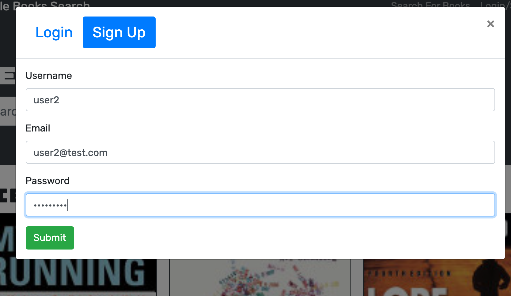

# Book Search Engine
Google Books API search engine built in MERN Stack. Other than searching for books, user can sign up and login their account to save their favorite books.

## Table of Contents
* Technologies
* Deployed App
* Screenshots

## Technologies
* MongoDB
* Express.js
* React.js
* Node.js

## Deployed App

https://book-search-9.herokuapp.com/

## Screenshots

)
)
)
